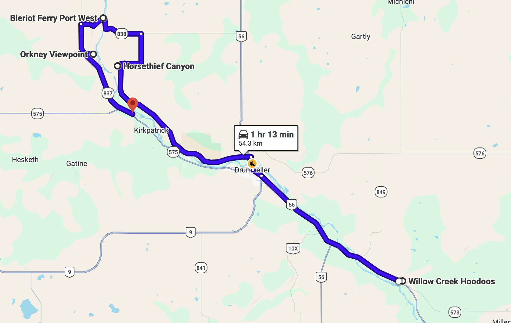

# Markdown Syntax

## Lists

### Unordered list:
- A
- C
- B
  - D

### Ordered list
1. One
2. Two
   1. Two and a half
3. Three
4. Four
5. Five

## Quotations
```
use three backwards apostrophes!
here is code
```

## Media

### Images




## Text fonts
This text is **bold**

This text is *italicized*

This text is ***bold and italicized***